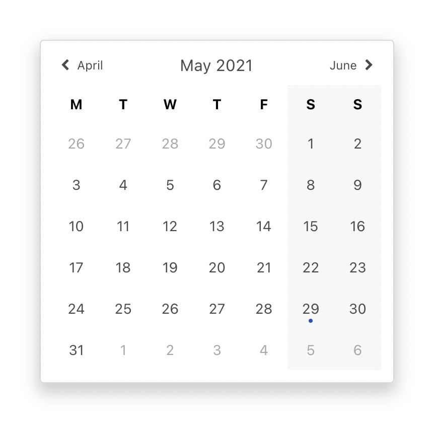
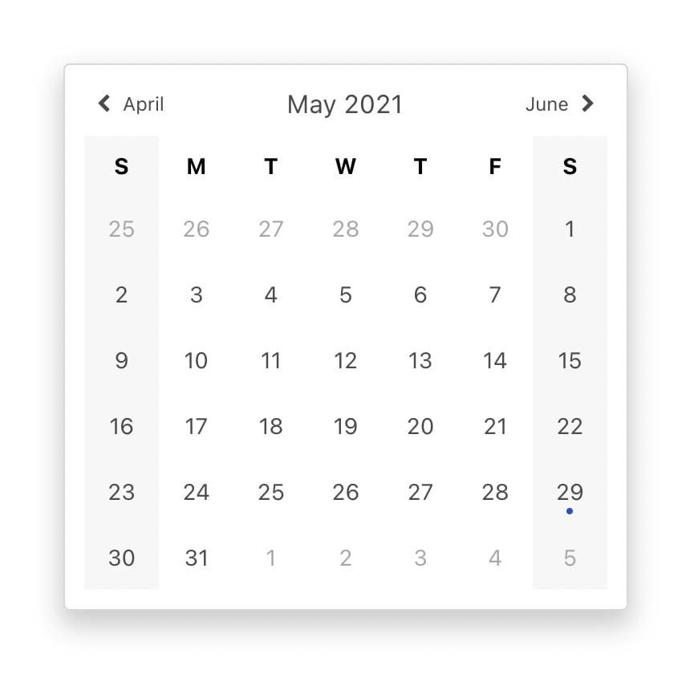
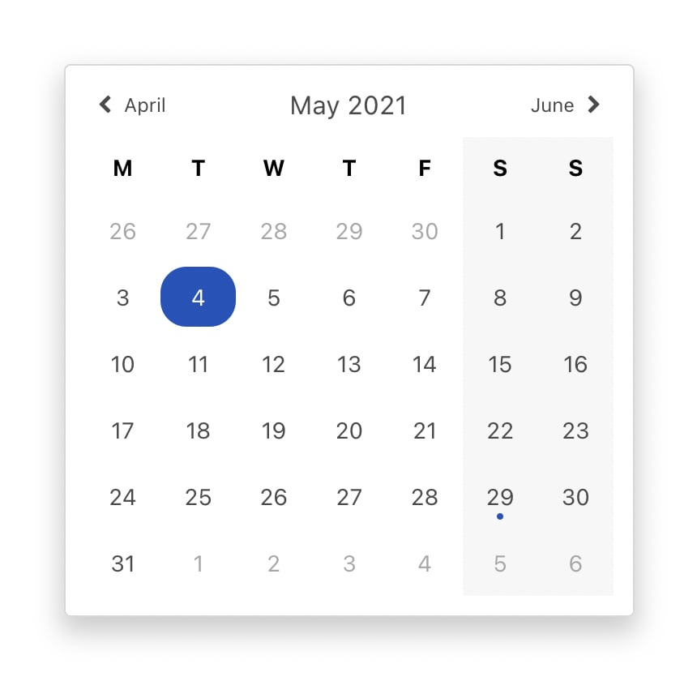
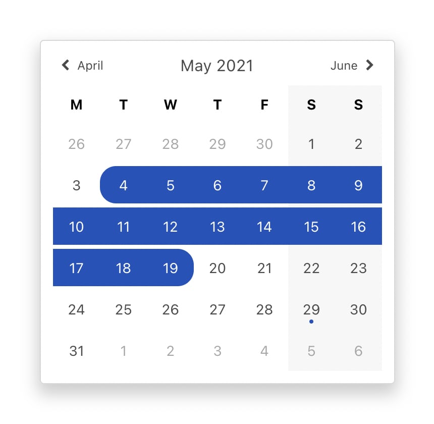
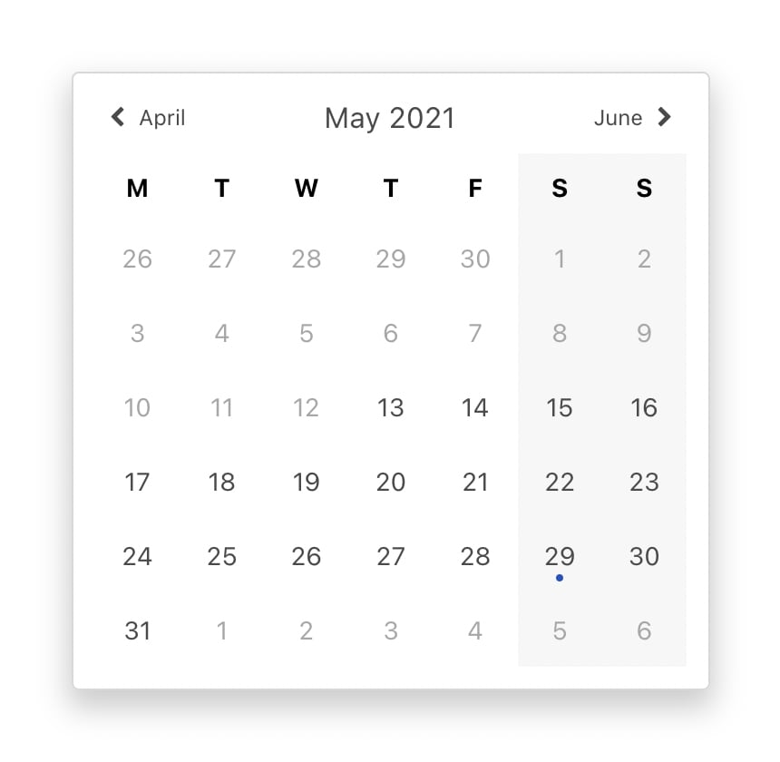
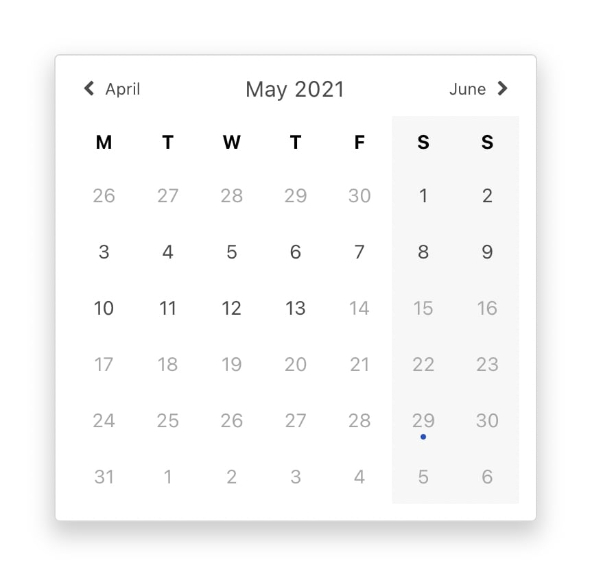
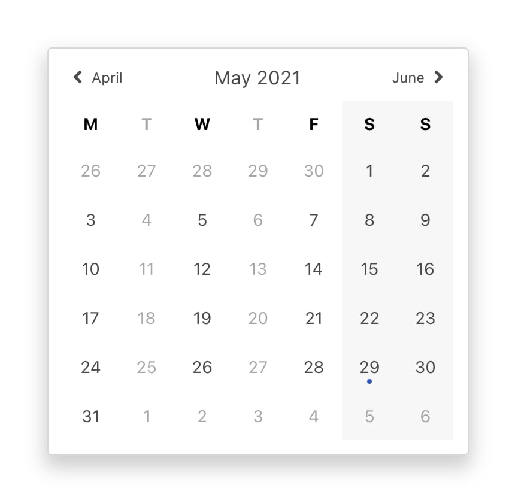
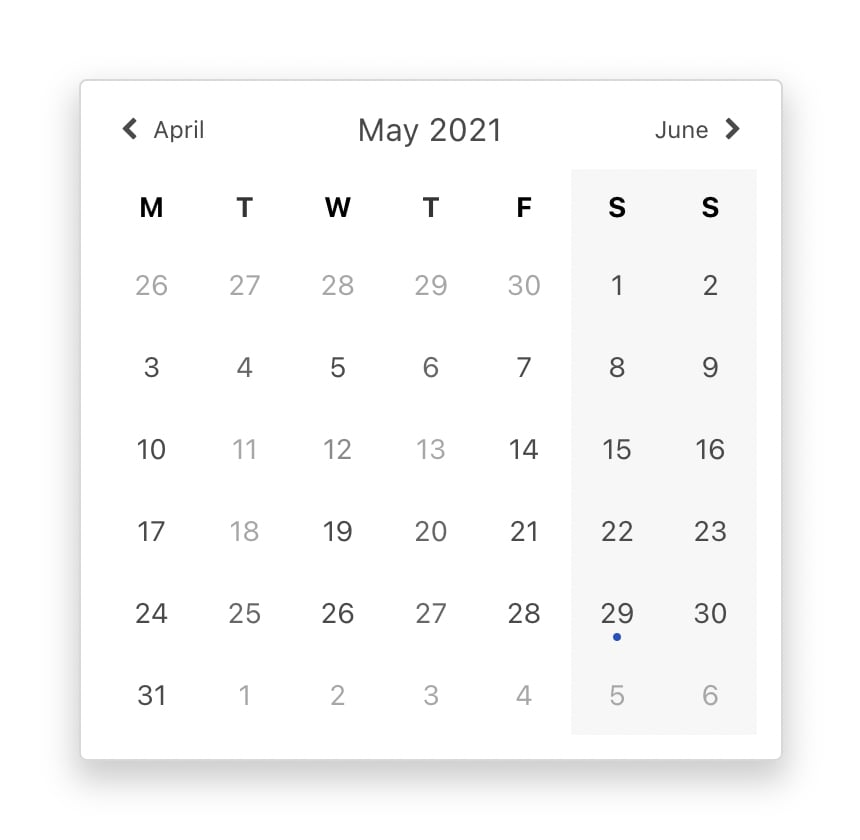

# calendar-builder :calendar:

[](http://travis-ci.org/mblarsen/calendar-builder)
[](https://codebeat.co/projects/github-com-mblarsen-calendar-builder-main)
[](https://snyk.io/test/github/mblarsen/calendar-builder)
[](https://www.npmjs.com/package/calendar-builder)
[](https://www.npmjs.com/package/calendar-builder)
[](https://github.com/mblarsen/calendar-builder/blob/main/LICENSE)

> All the logic you need to quickly build a custom calendar or date-picker for any framework or plain vanilla JavaScript.

### Features

- Generates data to populate a grid
- Split your events by date
- Supports fill or fitted weeks (filled weeks always shows 6 weeks)
- Supports before and after date
- Supports start of week
- Supports range selection
- Supports disabling certains days
- Supports disabling days of the week

| Feature               | Example                                                                                 |
| --------------------- | --------------------------------------------------------------------------------------- |
| Plain                 |  Today is marked with a dot                                |
| First day of week     |  First day of week is now 'Sunday' (default)           |
| Selection: single     |                                                 |
| Selection: range      |                                                  |
| After                 |  Only dates after the 12th of May 2021 are valid     |
| Before                |  Only dates before the 14th of May 2021 are valid   |
| Disable days of week  |  Tuesdays and Thursdays are disabled        |
| Disable specific days |  The days: 11, 12, 13, and 18 are disabled |

## Example usage

```
const options = {
  firstDay: 1 // Monday
}

let calendar = create(Date.now(), options)

const nextMonth = () => {
  calendar = create(calendar.next, options)
}

const prevMonth = () => {
  calendar = create(calendar.prev, options)
}
```

### Output

Sample output from calling `create()`

<details>
```
{
  config: {
    after: null,
    before: null,
    fillWeek: true,
    firstDay: 1,
    now: 2021-09-05T16:00:00.000Z,
    selection: null
  },
  next: 2021-09-30T16:00:00.000Z,
  prev: 2021-07-31T16:00:00.000Z,
  current: 2021-08-31T16:00:00.000Z,
  start: 2021-08-31T16:00:00.000Z,
  end: 2021-09-29T16:00:00.000Z,
  days: [
    {
      date: 2021-08-29T16:00:00.000Z,
      day: 30,
      dayOfWeek: 1,
      isToday: false,
      selection: null,
      state: 'valid',
      inMonth: false
    },
    {
      date: 2021-08-30T16:00:00.000Z,
      day: 31,
      dayOfWeek: 2,
      isToday: false,
      selection: null,
      state: 'valid',
      inMonth: false
    },
    {
      date: 2021-08-31T16:00:00.000Z,
      day: 1,
      dayOfWeek: 3,
      isToday: false,
      selection: null,
      state: 'valid',
      inMonth: true
    },
    {
      date: 2021-09-01T16:00:00.000Z,
      day: 2,
      dayOfWeek: 4,
      isToday: false,
      selection: null,
      state: 'valid',
      inMonth: true
    },
    {
      date: 2021-09-02T16:00:00.000Z,
      day: 3,
      dayOfWeek: 5,
      isToday: false,
      selection: null,
      state: 'valid',
      inMonth: true
    },
    {
      date: 2021-09-03T16:00:00.000Z,
      day: 4,
      dayOfWeek: 6,
      isToday: false,
      selection: null,
      state: 'valid',
      inMonth: true
    },
    {
      date: 2021-09-04T16:00:00.000Z,
      day: 5,
      dayOfWeek: 0,
      isToday: false,
      selection: null,
      state: 'valid',
      inMonth: true
    },
    {
      date: 2021-09-05T16:00:00.000Z,
      day: 6,
      dayOfWeek: 1,
      isToday: true,
      selection: null,
      state: 'valid',
      inMonth: true
    },
    {
      date: 2021-09-06T16:00:00.000Z,
      day: 7,
      dayOfWeek: 2,
      isToday: false,
      selection: null,
      state: 'valid',
      inMonth: true
    },
    {
      date: 2021-09-07T16:00:00.000Z,
      day: 8,
      dayOfWeek: 3,
      isToday: false,
      selection: null,
      state: 'valid',
      inMonth: true
    },
    {
      date: 2021-09-08T16:00:00.000Z,
      day: 9,
      dayOfWeek: 4,
      isToday: false,
      selection: null,
      state: 'valid',
      inMonth: true
    },
    {
      date: 2021-09-09T16:00:00.000Z,
      day: 10,
      dayOfWeek: 5,
      isToday: false,
      selection: null,
      state: 'valid',
      inMonth: true
    },
    {
      date: 2021-09-10T16:00:00.000Z,
      day: 11,
      dayOfWeek: 6,
      isToday: false,
      selection: null,
      state: 'valid',
      inMonth: true
    },
    {
      date: 2021-09-11T16:00:00.000Z,
      day: 12,
      dayOfWeek: 0,
      isToday: false,
      selection: null,
      state: 'valid',
      inMonth: true
    },
    {
      date: 2021-09-12T16:00:00.000Z,
      day: 13,
      dayOfWeek: 1,
      isToday: false,
      selection: null,
      state: 'valid',
      inMonth: true
    },
    {
      date: 2021-09-13T16:00:00.000Z,
      day: 14,
      dayOfWeek: 2,
      isToday: false,
      selection: null,
      state: 'valid',
      inMonth: true
    },
    {
      date: 2021-09-14T16:00:00.000Z,
      day: 15,
      dayOfWeek: 3,
      isToday: false,
      selection: null,
      state: 'valid',
      inMonth: true
    },
    {
      date: 2021-09-15T16:00:00.000Z,
      day: 16,
      dayOfWeek: 4,
      isToday: false,
      selection: null,
      state: 'valid',
      inMonth: true
    },
    {
      date: 2021-09-16T16:00:00.000Z,
      day: 17,
      dayOfWeek: 5,
      isToday: false,
      selection: null,
      state: 'valid',
      inMonth: true
    },
    {
      date: 2021-09-17T16:00:00.000Z,
      day: 18,
      dayOfWeek: 6,
      isToday: false,
      selection: null,
      state: 'valid',
      inMonth: true
    },
    {
      date: 2021-09-18T16:00:00.000Z,
      day: 19,
      dayOfWeek: 0,
      isToday: false,
      selection: null,
      state: 'valid',
      inMonth: true
    },
    {
      date: 2021-09-19T16:00:00.000Z,
      day: 20,
      dayOfWeek: 1,
      isToday: false,
      selection: null,
      state: 'valid',
      inMonth: true
    },
    {
      date: 2021-09-20T16:00:00.000Z,
      day: 21,
      dayOfWeek: 2,
      isToday: false,
      selection: null,
      state: 'valid',
      inMonth: true
    },
    {
      date: 2021-09-21T16:00:00.000Z,
      day: 22,
      dayOfWeek: 3,
      isToday: false,
      selection: null,
      state: 'valid',
      inMonth: true
    },
    {
      date: 2021-09-22T16:00:00.000Z,
      day: 23,
      dayOfWeek: 4,
      isToday: false,
      selection: null,
      state: 'valid',
      inMonth: true
    },
    {
      date: 2021-09-23T16:00:00.000Z,
      day: 24,
      dayOfWeek: 5,
      isToday: false,
      selection: null,
      state: 'valid',
      inMonth: true
    },
    {
      date: 2021-09-24T16:00:00.000Z,
      day: 25,
      dayOfWeek: 6,
      isToday: false,
      selection: null,
      state: 'valid',
      inMonth: true
    },
    {
      date: 2021-09-25T16:00:00.000Z,
      day: 26,
      dayOfWeek: 0,
      isToday: false,
      selection: null,
      state: 'valid',
      inMonth: true
    },
    {
      date: 2021-09-26T16:00:00.000Z,
      day: 27,
      dayOfWeek: 1,
      isToday: false,
      selection: null,
      state: 'valid',
      inMonth: true
    },
    {
      date: 2021-09-27T16:00:00.000Z,
      day: 28,
      dayOfWeek: 2,
      isToday: false,
      selection: null,
      state: 'valid',
      inMonth: true
    },
    {
      date: 2021-09-28T16:00:00.000Z,
      day: 29,
      dayOfWeek: 3,
      isToday: false,
      selection: null,
      state: 'valid',
      inMonth: true
    },
    {
      date: 2021-09-29T16:00:00.000Z,
      day: 30,
      dayOfWeek: 4,
      isToday: false,
      selection: null,
      state: 'valid',
      inMonth: true
    },
    {
      date: 2021-09-30T16:00:00.000Z,
      day: 1,
      dayOfWeek: 5,
      isToday: false,
      selection: null,
      state: 'valid',
      inMonth: false
    },
    {
      date: 2021-10-01T16:00:00.000Z,
      day: 2,
      dayOfWeek: 6,
      isToday: false,
      selection: null,
      state: 'valid',
      inMonth: false
    },
    {
      date: 2021-10-02T16:00:00.000Z,
      day: 3,
      dayOfWeek: 0,
      isToday: false,
      selection: null,
      state: 'valid',
      inMonth: false
    },
    {
      date: 2021-10-03T16:00:00.000Z,
      day: 4,
      dayOfWeek: 1,
      isToday: false,
      selection: null,
      state: 'valid',
      inMonth: false
    },
    {
      date: 2021-10-04T16:00:00.000Z,
      day: 5,
      dayOfWeek: 2,
      isToday: false,
      selection: null,
      state: 'valid',
      inMonth: false
    },
    {
      date: 2021-10-05T16:00:00.000Z,
      day: 6,
      dayOfWeek: 3,
      isToday: false,
      selection: null,
      state: 'valid',
      inMonth: false
    },
    {
      date: 2021-10-06T16:00:00.000Z,
      day: 7,
      dayOfWeek: 4,
      isToday: false,
      selection: null,
      state: 'valid',
      inMonth: false
    },
    {
      date: 2021-10-07T16:00:00.000Z,
      day: 8,
      dayOfWeek: 5,
      isToday: false,
      selection: null,
      state: 'valid',
      inMonth: false
    },
    {
      date: 2021-10-08T16:00:00.000Z,
      day: 9,
      dayOfWeek: 6,
      isToday: false,
      selection: null,
      state: 'valid',
      inMonth: false
    },
    {
      date: 2021-10-09T16:00:00.000Z,
      day: 10,
      dayOfWeek: 0,
      isToday: false,
      selection: null,
      state: 'valid',
      inMonth: false
    }
  ],
  now: 2021-09-05T16:00:00.000Z
}
```
</details>

## Options

Note that the

- `month` in `CalendarDate` is 1-based and that,
- `day` is what is called 'date' in the Date APi.

```typescript
type CalendarDate =
  | { year: number; month: number; day?: number }
  | string
  | number
  | Date;

interface CalendarEvent<T = any> {
  label: string,
  date: Date
  value?: T
}

type CalendarBuilderOptions = {
  /**
   * The first day of the week
   *
   * Default: 0
   */
  firstDay: number;
  /**
   * Add a fill week to the end even if not needed. This is useful to avoid
   * "flicker" when some months are 4-6 weeks only.
   *
   * Default: true
   */
  fillWeek: boolean;
  /**
   * Mark dates before this time invalid (excluding)
   *
   * E.g. after = 2021-05-29, then first valid date is 2021-05-30.
   */
  after: CalendarDate;
  /**
   * Mark dates after this time invalid (excluding)
   *
   * E.g. before = 2021-05-29, then last valid date is 2021-05-28.
   */
  before: CalendarDate;
  /**
   * Mark days in this range as selected. The selection state of the day may
   * vary if it is the first, last, middle, or only day in the selection.
   */
  selection: [CalendarDate, CalendarDate];
  /**
   * Optionally pas in date for when is 'now'.
   */
  now: CalendarDate;
  /**
   * Disable days of the week
   */
  disableDaysOfWeek: number[];
  /**
   * Disable specific days
   */
  disableDays: CalendarDate[];
  /**
   * Events to "bucket". Will distribute an array of events into the
     event-bucket on each of the calendar days.
   */
  events: CalendarEvent[];
};
```
